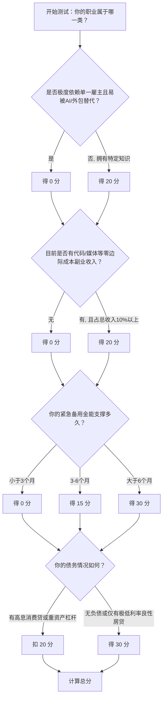

# 通缩时代的凛冬生存指南：基于纳瓦尔财富哲学的反脆弱构建

早高峰的地铁里，你的微信群正弹出几条消息：“公司今年取消了普调”“隔壁组又裁了两个”“楼下常吃的那家牛肉面馆关门了”……在这股无声的寒气中，你能切身感受到什么是“通缩”。

当货币购买力表面上升（东西变便宜了），但获取货币的难度呈指数级增加（降薪、裁员、资产缩水）时，普通人究竟该如何生存？

硅谷创投教父纳瓦尔·拉维坎特（Naval Ravikant）曾指出：“在这个世界上，真正能带来财富的，是你独一无二的专长、无需许可的杠杆以及精准的判断力。”在通缩周期里，这套理论不仅是致富经，更是普通人保命的“防弹衣”。本文将系统性拆解如何利用纳瓦尔的核心思想，在经济凛冬中保护购买力、积累稀缺资产并构建反脆弱现金流。

---

## ❶ 特定知识（Specific Knowledge）：从“可替代零件”到“稀缺手艺人”

**【凛冬洞察】**
在通缩环境下，所有标准化、规模化的产品和服务都在惨烈地打价格战。你所在的行业如果只是在做“体力或基础脑力的简单重复”，你的工资就会像菜市场里收摊前的烂叶菜一样，被无情贱卖。
å
**【纳瓦尔视角】**
> “建立特定知识，这种知识不能被轻易传授。如果可以被传授，那别人也可以被训练来取代你。”

想象一下菜市场里的两个摊贩：一个是只会扫码收银的理货员，另一个是能根据你今晚要做的菜，精准挑出最合适部位、甚至顺手帮你切好配好姜蒜的“肉铺张阿姨”。前者在通缩中会被自助收银机和降薪潮淘汰，而张阿姨拥有的是不可替代的“特定知识”——基于人情世故、经验判断和客户偏好的微观洞察。

> **数据印证**：世界经济论坛（WEF）发布的《2023年未来就业报告》显示，未来五年内，高达8300万个工作岗位将因自动化和经济压力面临风险，近四分之一的现有工作将被彻底颠覆（发布时间：2023年5月）。

在通缩期，你必须成为那个“张阿姨”，而不是理货员。

**💡 3步微行动清单（今天就能做）：**
1. **盘点你的“童年热爱”或“边缘技能”**：写下3件你在工作中觉得像玩，但别人觉得很累的事（比如：特别擅长用Excel做丑但极度实用的排班表）。
2. **组合你的技能点**：不要在单一技能上卷前1%，而是在3个技能（比如：PPT排版 + 某冷门行业知识 + 幽默感）上做到前25%。
3. **输出一个不可替代的MVP（最小可行性产品）**：写一篇经验帖或做一个小工具分享给同事/客户。
> **量化验收标准**：本周内列出3项组合技能，并在30天内在公开平台（如小红书/公司内网）发布1条相关经验分享，获得至少10个真实的互动反馈。

---

## ❷ 杠杆（Leverage）：用“零边际成本”对抗“购买力缩水”

**【凛冬洞察】**
通缩时期，借钱（资本杠杆）是极其危险的。因为你的债务金额是不变的，但你的收入和资产价格在下跌。过去那种“借钱买房开店，靠通胀稀释债务”的玩法，在通缩期等于慢性自杀。

**【纳瓦尔视角】**
> “忘掉资本和劳动力杠杆。代码和媒体才是无需许可的杠杆。它们是新富阶层背后的魔法。”

回到你的通勤地铁上。你刷着短视频，看着某位博主在讲如何低成本做饭。这位博主没有雇佣团队（无劳动力杠杆），也没有向银行贷款百万（无资本杠杆），但他录制一次视频，就可以被10万人观看。这就是“零边际成本”的媒体杠杆。在通缩期，你的时间极度不值钱，唯一能保值的就是创造“睡后可以无限复制”的资产。

> **数据印证**：高盛（Goldman Sachs）在2023年4月发布的报告指出，全球创作者经济（Creator Economy）的市场规模为2500亿美元，并在未来五年内将翻倍增长至4800亿美元。在这个领域，零边际成本的杠杆正在造就新一代的财富抗跌者。

**💡 3步微行动清单（今天就能做）：**
1. **停止无效的“用时间换钱”**：削减每周3小时毫无意义的应酬或无脑加班。
2. **建立你的“数字分身”**：注册一个自媒体账号，或开通一个GitHub/个人博客，开始记录你的“特定知识”。
3. **完成第一次“无需许可”的杠杆发布**：哪怕只是把你解决某个工作Bug的过程录屏发到B站，或者写成一篇文章。
> **量化验收标准**：本周完成1次跨平台的内容发布或代码提交；30天内，确保每周至少有2个小时用于构建“零边际成本”资产。

---

## ❸ 判断力（Judgment）：通缩期的资产清算与“真金”识别

**【凛冬洞察】**
通缩期“现金为王”是一个常见的陷阱。短期内现金确实最安全，但如果你一直抱着现金，一旦经济周期转向或央行放水，你将错过底部的廉价筹码。真正的赢家，是在通缩引发的“资产清算超市”里，挑出被错杀的优质资产。

**【纳瓦尔视角】**
> “如果你拥有特定知识和杠杆，接下来你获得报酬的标准就是你的判断力。”

微信聊天里，朋友们都在恐慌性地抛售股票、割肉基金。而拥有判断力的人，此时正在冷静地评估哪些核心城市的房产、哪些拥有强劲现金流的指数或公司被严重低估。但判断力的前提是“不被强迫出局”——你必须有足够的现金流护城河，才能在别人恐慌时保持理智。

> **数据印证**：美联储（Federal Reserve）在2024年5月发布的《2023年美国家庭经济状况报告》显示，只有63%的成年人能完全依靠现金或储蓄支付400美元的突发紧急费用，而13%的人无法通过任何方式支付。缺乏应急资金，直接导致人们在经济波动中失去“判断力”，被迫贱卖资产。

**💡 3步微行动清单（今天就能做）：**
1. **建立“通缩防弹基金”**：清点你所有的活期和易变现资产，确保它们能覆盖你至少6-12个月的硬性生活开支。
2. **削减“面子消费”与负债**：砍掉不必要的会员续费，将高息消费贷/信用卡的欠款列为最高优先级还清。
3. **建立你的“愿望资产清单”**：列出3个你一直看好、但过去嫌贵的核心资产（如某只宽基指数、某项硬核技能课程），设定一个“通缩击球区”价格。
> **量化验收标准**：本周内完成一次家庭账单大瘦身，取消至少1项隐形扣费；30天内将储蓄率（每月存下金额/月收入）提升≥5%。

---

## ❹ 长期主义（Long-termism）：用“复利游戏”熬过“经济寒冬”

**【凛冬洞察】**
通缩就像是一场残酷的大雪，它会冻死所有只顾眼前利益的短线投机客。潮水退去，那些炒作概念、玩击鼓传花的人纷纷破产。但对于真正做实事的人来说，这反而是排除干扰、建立深厚复利的最佳时期。

**【纳瓦尔视角】**
> “生活中所有的回报，无论是财富、人际关系还是知识，都来自复利。和长线玩家玩长线游戏。”

看看你的职场朋友圈，那个每半年跳槽一次、每次只为涨薪2000块的人，在通缩期往往最先失业，因为他们没有沉淀任何长期价值。而那个花5年时间在一个领域深耕、结交了一群靠谱同行的人，即便公司倒闭，也会迅速被熟人网络内推接盘。

> **数据印证**：央行《2023年第四季度城镇储户问卷调查报告》（2023年12月发布）及后续2024年数据表明，倾向于“更多储蓄”的居民占比常年高居61%以上。大众普遍在收缩防守，但PitchBook（2023）数据也揭示，全球创投领域的短期热钱（如创作者经济风投从70亿美元骤降至43亿美元）正在大举撤退。投机资金离场，正是长线玩家安心筑底的黄金时刻。

**💡 3步微行动清单（今天就能做）：**
1. **清理你的“短线社交圈”**：屏蔽或退出3个天天抱怨大环境、散播焦虑却没有行动的微信群。
2. **主动链接一个“长线玩家”**：约一个你敬佩的、在行业内深耕多年且心态稳定的前辈/朋友喝杯咖啡或打个语音。
3. **确立一个5年不变的目标**：问自己：“即使未来5年经济一直不好，我每天坚持做哪件事依然是有价值的？”（比如健身、写作、学英语）。
> **量化验收标准**：本周内退出/免打扰至少3个无效社交群；30天内与至少1位行业内的“长线玩家”进行一次深度交流。

---

## ❺ 通缩压力测试表：5分钟测出你的财务免疫力

在实施任何策略前，先用以下模型评估你的“抗通缩韧性”：

### 📊 得分与策略匹配指南：

*   **0 - 30分（红灯区：极度脆弱）**
    *   **诊断**：你正站在通缩的悬崖边。一旦遭遇裁员或降薪，资金链将瞬间断裂。
    *   **策略**：**全面防御**。停止一切非必要消费，立刻变现闲置物品，集中所有精力还清高息负债。暂缓一切投资，保住本职工作是第一要务。
*   **35 - 70分（黄灯区：勉强生存）**
    *   **诊断**：有一定的缓冲垫，但依然是在“用时间换钱”的仓鼠轮里奔跑。
    *   **策略**：**稳中求变**。用你的备用金买来的安心感，投入每周至少5小时去挖掘“特定知识”和构建“无需许可的杠杆”。开始定投优质核心资产。
*   **75 - 100分（绿灯区：反脆弱体质）**
    *   **诊断**：你不仅能安然度过通缩，甚至能在资产大打折的时期实现阶层跃迁。
    *   **策略**：**主动出击**。保持极度耐心，发挥你的“判断力”，在市场哀鸿遍野时，大胆抄底被错杀的稀缺资产（不论是金融资产还是人才资产）。

---

## ❻ 纳瓦尔通缩金句速查卡（建议打印贴冰箱）

为对抗通缩带来的心理内耗，建议将以下“纳瓦尔心法”保存或打印，每天默读一遍：

> 🛡️ **【生存底线】**
> “最危险的状态，是用一份随时可被替代的时间，换取不断贬值的死工资，还背着一堆随时催收的消费债。”
>
> 🧠 **【关于专长】**
> “在这个时代，如果你不能成为某个细分领域的全世界前沿，大环境的寒气就会第一个冻伤你。”
>
> 🚀 **【关于杠杆】**
> “赚钱的本质不是比谁更辛苦。在通缩期，穷人靠体力内卷，富人靠代码和内容24小时印钞。”
>
> ⚖️ **【关于判断力】**
> “没有流动性的资产在通缩期就是负债。保有现金流，是为了在别人被迫离场时，你有资格坐在牌桌上捡筹码。”
>
> ⏳ **【关于长线】**
> “把时间维度拉长到10年，眼前的宏观波动不过是图表上的一个像素点。玩复利游戏，做个长期乐观主义者。”

---

*（本文结合 Naval Ravikant 的财富哲学进行本土化与周期化推演。无论宏观经济是通胀还是通缩，投资自己、积累专长与杠杆，永远是穿越牛熊的唯一解。）*
